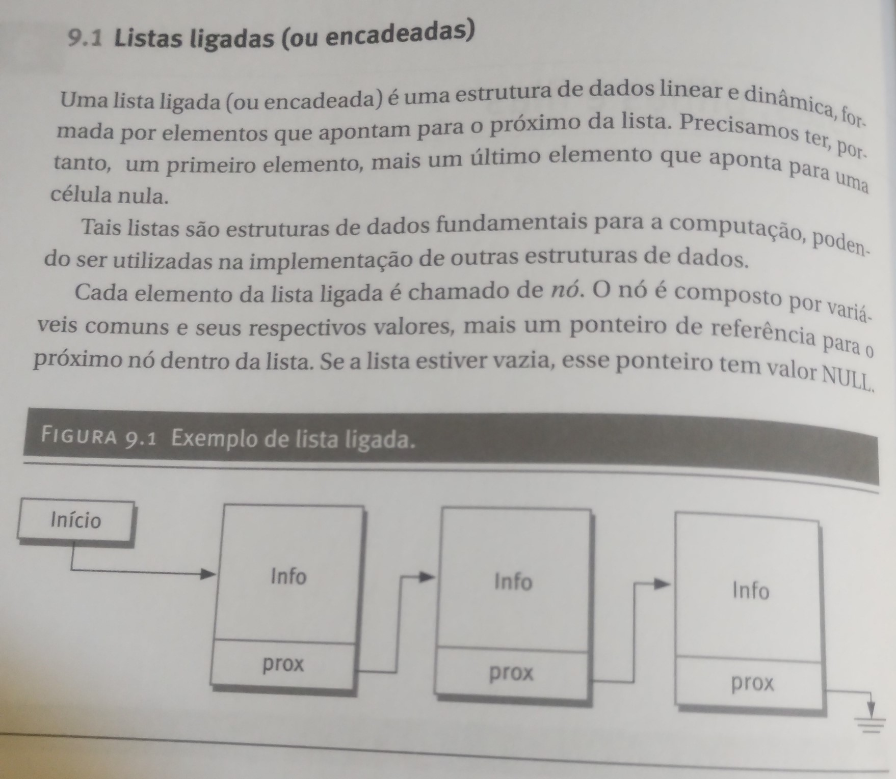

# Exercícios e Exemplos - Capítulo 9

## Sobre o Repositório
Este repositório contém exemplos e exercícios do Capítulo 9 sobre Listas, Pilhas e Filas em C. Os exemplos e exercícios foram desenvolvidos para auxiliar no aprendizado e prática dos conceitos abordados neste capítulo.

- Autor: carlinhoshk
- Data: 09/02/2024

## Conteúdo
O Capítulo 9 do livro aborda os seguintes tópicos:
- Listas Encadeadas
- Pilhas
- Filas

Este repositório inclui:
- Exemplos de código para demonstrar a implementação e uso de listas, pilhas e filas em C.
- Exercícios propostos no livro para praticar os conceitos apresentados.
- Soluções para os exercícios, permitindo a verificação e aprendizado do usuário.

